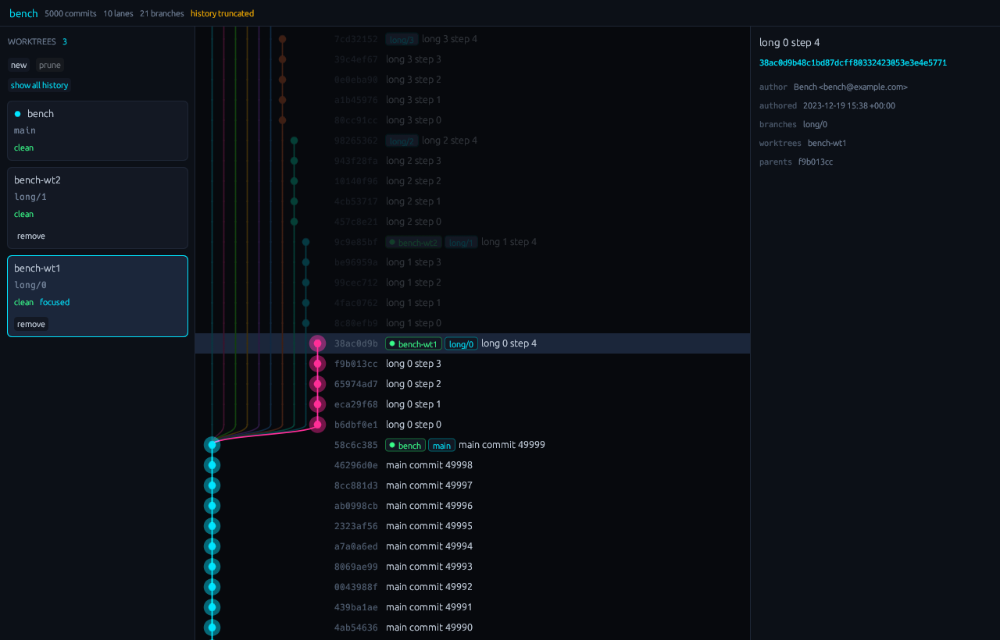
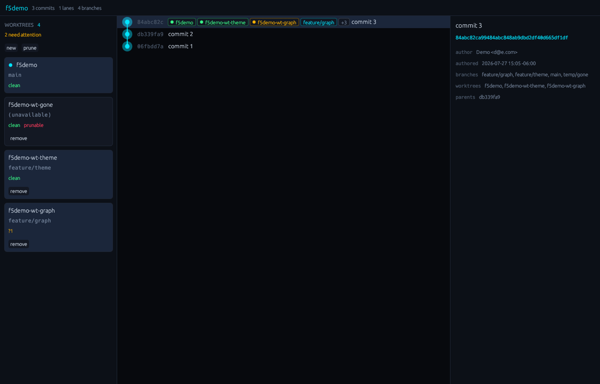

# sylva

A fast, native Git client built around worktrees.

*Sylva* is Latin for woodland: many trees sharing one ground. That is what a Git
repository with worktrees is, and it is the thing this client is built to show.



## Why

Git worktrees let you keep several branches checked out at once, each in its own
directory. They are the cleanest way to work on more than one thing without
stashing, and every free Git client treats them as an afterthought — a list in a
menu, if they appear at all.

sylva puts them in the middle:

- **One graph for the whole repository.** Every worktree appears as a coloured
  marker on the commit it is sitting on, with its dirty state on the badge. You
  see how your checkouts have diverged from each other, in one picture.
- **Focus a worktree** and the graph dims everything that worktree cannot see,
  so a single line of work stays readable inside a history hundreds of branches
  share.
- **Create, remove and prune worktrees** without leaving the window, with the
  refusals that `git worktree` does not give you.

## Screens



The panel lists every checkout with its branch, divergence from upstream, and
uncommitted file counts. Removal asks first, names the directory, and says how
many files would be lost.

## Status

The first version is a **visualizer plus worktree operations**. It reads history
and writes nothing but worktrees.

**It does:** the commit graph, branches, worktree state and focus, commit
details, and worktree add / remove / prune.

**It does not (yet):** stage, commit, push, pull, merge, rebase, or show diffs.
For those, the terminal is still where you go.

## Building

Requires a Rust toolchain and a C compiler. Nothing else — the `git2` dependency
builds libgit2 from source with the network transports switched off, so there is
no OpenSSL, no `pkg-config` and no `cmake` in the way.

```sh
cargo build --release
./target/release/sylva /path/to/a/repository
```

Tested on Debian with GNOME under Wayland. It should work anywhere `eframe`
does; nothing in it is Linux-specific except the assumption that `git` is on the
`PATH`.

## Usage

```
sylva [PATH]                 open the window (PATH defaults to the current directory)
sylva --focus NAME           open with one worktree's history highlighted
sylva --full                 load all history instead of the first 5,000 commits
sylva --cli [PATH]           print the graph as text
sylva --profile [PATH]       time the load and layout paths
sylva --screenshot FILE      render one frame to a PNG and exit
```

`--cli` and `--screenshot` exist so the rendering and the Git layer can be
checked without a person watching a screen. They found four bugs that no unit
test would have.

## Performance

Measured against a synthetic repository of 50,050 commits with 21 refs and 3
worktrees. Release build, warm, best of nine runs on a 16-core machine:

| workload | read Git | lay out the graph |
|---|---|---|
| first page (5,000 commits) | 92 ms | 0.8 ms |
| all 50,050 commits | 408 ms | 14.3 ms |

Both happen on a worker thread; the window paints from its first frame and never
blocks. Only the rows inside the viewport are drawn, so scrolling costs the same
at commit 50,000 as at commit 1.

The release binary is about 9.6 MB.

## How it is put together

Dependencies point inwards only:

```
ui  ->  application  ->  domain
             ^
     infrastructure
```

- **`domain`** — commits, branches, worktrees, the graph layout, and reachability.
  Depends on no external crate at all, so the rules of the product are testable
  without a repository on disk.
- **`application`** — use cases, and the ports they need. Never names a Git
  implementation.
- **`infrastructure`** — libgit2 for reading, the `git` command for worktree
  operations (it does bookkeeping libgit2 leaves to its caller), and a
  filesystem watcher.
- **`ui`** — egui on OpenGL. Renders an immutable snapshot and never reads Git
  itself.

Swapping libgit2 for something else means adding one module in
`infrastructure`. Restyling means editing `ui/theme.rs`, which is the only place
in the program that knows what a colour is.

## Tests

```sh
cargo test
```

207 of them: unit tests over the pure layers, and integration tests that build
real repositories with the `git` CLI — worktrees, detached HEADs, deleted
checkouts, and the operations that create and delete directories.

## Licence

MIT.
